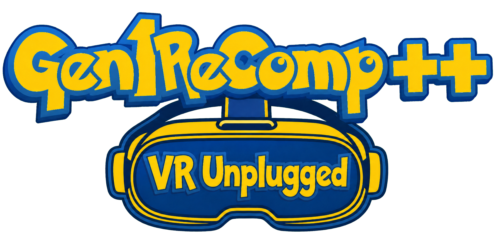

# Gen1Recomp — VR Unplugged

<p align="center">
  
</p>

<p align="center">
  <strong>A standalone first-person voxel overhaul of Pokémon Red, Blue, and Yellow for Meta Quest.</strong>
</p>

VR Unplugged is more than an Android port. The goal is to turn Kanto into a
complete standalone VR experience: a spatial launcher, native stereo OpenXR,
6DoF head tracking, Touch controls, a tracked Pokédex, first-person voxel
environments, visible wild Pokémon, followers, physical catching, and a
Quest-tested mod stack that works as one cohesive overhaul.

No gaming PC, Link, SteamVR, or Virtual Desktop is needed while playing. A PC
is only needed to sideload the APK. The project is physically tested on
**Meta Quest 3**; Quest 3S is an intended target but has not yet received the
same validation coverage.

> [!IMPORTANT]
> This is a public beta. The core experience is playable, but performance,
> long-session stability, and parts of the enhanced mod stack are still being
> finished. See [Development progress](#development-progress) before treating
> it as a polished release.

> [!CAUTION]
> **We are not affiliated with `gen1recomp[.]com`.** That website is not run
> or authorized by this project. Do not download anything from it. This GitHub
> repository and the Discord linked below are the only official sources for
> VR Unplugged.

## Download and install

<p align="center">
  <a href="https://github.com/HimioneGranger/Gen1recomp-Quest-Standalone/releases/latest/download/Gen1Recomp-VR-Unplugged-v0.1.81-Quest.apk"><strong>Download the latest Quest APK</strong></a>
</p>

1. Enable Developer Mode on your headset and connect it by USB.
2. Install the APK with SideQuest, or run:

   ```sh
   adb install -r Gen1Recomp-VR-Unplugged-v0.1.81-Quest.apk
   ```

3. In the headset, open **App Library → Unknown Sources → Gen1Recomp VR
   Unplugged**.
4. Use the room-anchored launcher to import your own supported ROM.
5. Import Quest-compatible mod ZIPs separately from the launcher's **MODS**
   tab. Mods are not bundled with the APK.

When updating, use `adb install -r` so Android keeps your app data. Back up
important saves before upgrading.

## What the Quest overhaul adds

| Feature | What it does | Current state |
| --- | --- | --- |
| Standalone Quest build | Runs directly on Quest as a native ARM64 Android APK | Working on Quest 3 |
| Spatial launcher | Places the existing launcher on a readable room-anchored panel with a Touch-controller pointer | Working |
| OpenXR handoff | Cleanly transfers ownership from the flat launcher session to immersive gameplay | Working |
| Native stereo VR | Per-eye rendering, OpenXR view/projection data, and 6DoF head tracking | Working |
| Tracked controls and UI | Touch input for navigation, movement, menus, turning, recentering, and mod interactions | Working |
| Tracked Pokédex | Uses the left-hand display for menus, dialogue, and game information | Working; battle framing needs polish |
| Quest graphics controls | Adjustable refresh request, eye resolution, draw distance, scale, player height, shadows, and comfort settings | Working |
| On-headset content management | Imports supported ROMs, save files, and compatible mod ZIPs through Android's file picker | Working |
| Multi-game launcher | Keeps Red, Blue, and Yellow profiles, save slots, and mods in private app storage | Working |
| Save-safe updates | A replacement APK can retain existing private app data | Working; backups are still recommended |

The launcher accepts canonical US Red, Blue, Yellow, and Gold ROMs. Red, Blue,
and Yellow are the current VR focus. Gold import and the developing flat Gen 2
engine are available, but **Gold voxel/VR gameplay is not implemented yet**.

## Recommended complete-experience mod stack

The APK provides the Quest host, launcher, and game engine. The immersive
overhaul is assembled from separately maintained mods so each author keeps
ownership of their work and each component can be updated, disabled, or
removed independently.

Only install ZIPs specifically marked as Quest compatible. Upstream desktop
packages may lack the OpenXR, input, memory, or rendering changes required on
the headset. Quest builds are distributed through this project's official
release/Discord channels when author permission and testing allow it.

### Stable baseline

| Mod | What it adds | Quest status |
| --- | --- | --- |
| [Dramaless Shape](https://github.com/artyrambles/DRAMALESS_SHAPE/tree/v2.0.0) Quest | The stereo voxel renderer, VR camera, world geometry, lighting, water, battles, and OpenXR gameplay conductor | Core 2.0 migration is about **96%** complete |
| [Kanto in First Person](https://github.com/mrmushrooms11/kanto-first-person/releases/tag/firstperson1.60.0) Quest | First-person interiors, ceilings, caves, skyline, weather, foliage, particles, doors, and corrected battle stages without changing game logic or saves | `1.60.0-quest.7` is integrated and hardware-tested |
| [Crystal 251](https://github.com/Deftones565/gen1recomp-mod-crystal-251/releases/tag/v0.10.3) | Expanded species/content support used by the enhanced visual stack | `0.10.3` is integrated and smoke-tested |
| HGSS Visual Overhaul | Gen 4-style sprite presentation and icon sources for the enhanced stack | `0.3.1` works on Quest; public fork distribution still needs its license/asset audit completed |
| [Wild Skies](https://github.com/shanehudson-gen1recomp-mods/wild_skies/releases/tag/v1.8.0) | Flyer support and additional overworld life | `1.8.0` is integrated and hardware-tested |

### Near-complete additions

| Mod | What it adds | Quest status |
| --- | --- | --- |
| [Wilds of Kanto](https://github.com/YoDrehDenSwagAuf/overworld-spawn-mod/releases/tag/v2.0.1) Quest | Visible wild Pokémon, followers, overworld behavior, optional direct catching, a tracked held Poké Ball, and stereo ball flight | q8 is about **97%** complete; the final low-poly and Stadium-model headset gate remains |
| [StadiumBattleFX](https://github.com/anxiousintrovert/StadiumBattleFX) Quest | Keeps Stadium/Stadium 2 imports in one bounded private cache and supplies optional authentic Poké Ball models to Wilds | Provider integration is about **80%** complete; automated tests pass and physical appearance/performance testing remains |
| Crystal 251 ROM Sprite Provider | Supplies additional ROM-derived sprites to compatible overworld mods without bundling commercial assets | About **86%** complete; remaining species and secondary-Flying coverage needs headset validation |

For the most dependable experience today, use the stable baseline first. Add
Wilds/Stadium candidates only when the release notes identify the exact pair
as hardware-approved. The launcher can disable a mod without deleting it.

### Compatibility guardrails

- **PotatoVoxel** is an alternative renderer and conflicts with the primary
  Dramaless/Kanto stack. Do not enable both stacks together.
- **Dramaless + Battle Art Quest** is an isolated experimental renderer path,
  not part of the recommended baseline yet.
- **Stadium Pokédex Viewer** is excluded because its current renderer can grow
  GPU usage without a safe bound during long Pokédex browsing.
- **Side Door Fix** and **Dramatic Sky Ride** remain test projects until their
  visual, input, interaction, and performance gates pass.

## Recommended Quest 3 settings

Start with:

- **Refresh rate:** 72 Hz
- **Resolution:** Full
- **Shadows:** Low
- **Render distance:** Medium

This is the current readability/performance baseline. Half resolution lowers
memory pressure but noticeably reduces sharpness. Initial ROM extraction and
voxel preparation take longer than later launches, and entering a new complex
area can still cause a visible streaming hitch.

## Development progress

These are maintainer planning estimates as of **August 14, 2026**. They include
physical-headset validation, not just code completion, and will move as new
bugs or upstream changes are discovered.

| Area | Progress | What remains |
| --- | ---: | --- |
| Overall playable Quest release | **80%** | Performance, lifecycle soak, mod-pair validation, broader route coverage, and release hardening |
| Standalone Quest/OpenXR core | **90%** | Longer suspend/resume, controller sleep, repeated handoff, transition, and quit stress testing |
| Stable first-person voxel experience | **92%** | Performance/rollback gates and additional world/battle presentation validation |
| Dramaless 2.0 Quest migration | **96%** | Repeat regression coverage and maintainability cleanup |
| Wilds of Kanto 2.0.1 Quest | **97%** | Final q8 low-poly behavior, physical throwing/catching, and optional Stadium-provider headset pass |
| Stadium Ball model integration | **80%** | Physical model checks, performance measurement, and automatic fallback validation |
| Gen 2/HGSS sprite providers | **86%** | Remaining species coverage plus license and asset-provenance work |
| Performance and lifecycle hardening | **70%** | Memory/thermal reduction, transition latency, long-session testing, and intermittent startup investigation |
| Battle Art transition/precache integration | **10%** | Architecture and asset audit before implementation can move into the accepted stack |
| Gold/Gen 2 voxel VR | **10%** | Most immersive rendering, interaction, and mod-integration work is still ahead |
| Portal/mixed-reality modes | **10%** | Prototype and research stage |
| Whole long-term overhaul vision | **46%** | Includes finished Gen 1 VR, Gen 2 VR, MR modes, broader hardware support, and optional integrations |

### Current priorities

1. Finish the Wilds q8 and StadiumBattleFX paired headset gate.
2. Reduce memory use, heat, and transition stalls without sacrificing full
   resolution.
3. Run 30–60 minute traversal, battle, suspend/resume, and quit stress tests.
4. Validate more cities, forests, caves, interiors, Victory Road, Indigo
   Plateau, Fly/warp transitions, saves, and battles.
5. Finish Pokédex battle framing and remaining visual polish.
6. Keep Quest changes maintainable as the upstream engine evolves.

### Known performance cost

The complete mod-heavy voxel stack is substantially more expensive than flat
gameplay. Recent Quest 3 traversal samples at full resolution and low shadows
generally land in the high-20s to mid-30s FPS while the headset requests
72 Hz. Full-stack process memory has measured roughly 2.0–2.3 GB, with device
temperature around 50–53 °C during demanding sessions. These are development
measurements, not promised final targets, and improving them is the largest
remaining release task.

## Project boundaries

This project contains **no ROM, save, extracted ROM cache, or commercial game
assets**. You must provide your own legally obtained supported ROM. The
importer verifies it, creates a private cache in the app's writable storage,
and releases the ROM from memory. The ROM itself is not copied into that
cache.

VR Unplugged is a fan project and is not affiliated with or endorsed by
Nintendo, Game Freak, Creatures Inc., The Pokémon Company, or Meta.

The Quest overhaul builds on
[Gen1Recomp](https://github.com/bryanthaboi/gen1recomp), the hand-written
Lua/LÖVE recreation maintained by Bryan and its contributors. The Quest path
is developed as a collaboration around that foundation while the standalone
OpenXR integration and Quest mod forks are maintained and tested here.

## Support, bugs, and collaboration

**Support / announcements / Quest-compatible mods:**
[Discord](https://bois.icu)

- Quest problem: [open a Quest report](https://github.com/HimioneGranger/Gen1recomp-Quest-Standalone/issues/new?template=quest_report.yml)
- Engine or launcher idea: [open a feature request](https://github.com/HimioneGranger/Gen1recomp-Quest-Standalone/issues/new?template=feature_request.yml)
- Mod request: [open a mod request](https://github.com/HimioneGranger/Gen1recomp-Quest-Standalone/issues/new?template=mod_request.yml)
- Contributors: start with [CONTRIBUTING.md](CONTRIBUTING.md)
- Release maintainers: use the [Quest release checklist](docs/quest-release-checklist.md)
- OpenXR architecture: read the [Quest backend notes](docs/quest-openxr-backend.md)
- Upstream platform maintainers: the preserved Switch **CI vs release**
  contract remains documented in [switch-build.md](docs/switch-build.md)

Development is coordinated through issues and pull requests so maintainers can
see decisions, reproduce builds, and continue work without relying on a private
chat history.

## Watch the latest update

[](https://www.youtube.com/watch?v=8IOgqbe4YvA)

<p align="center">
  <a href="https://www.youtube.com/@bryanthaboi"></a>
  <a href="https://www.tiktok.com/@bryanthaboi"></a>
  <a href="https://x.com/bryanthaboi"></a>
  <a href="https://bsky.app/profile/bryanthaboi.live"></a>
  <a href="https://www.instagram.com/bryanthaboi"></a>
</p>

## Credits

Thank you to the Gen1Recomp contributors, every original mod author who has
worked with us on Quest compatibility, the testers putting real headset time
into the project, and [pret](https://github.com/pret) and the
[pokered](https://github.com/pret/pokered) contributors whose research makes
accurate recreation possible.

- [Bo Layer (`@BoLayerDev`)](https://github.com/BoLayerDev) - former
  collaborator; contributed to Quest integration, build and launcher work, and
  repository development.

<p align="center"><a href="https://boisclub.games"></a></p>
